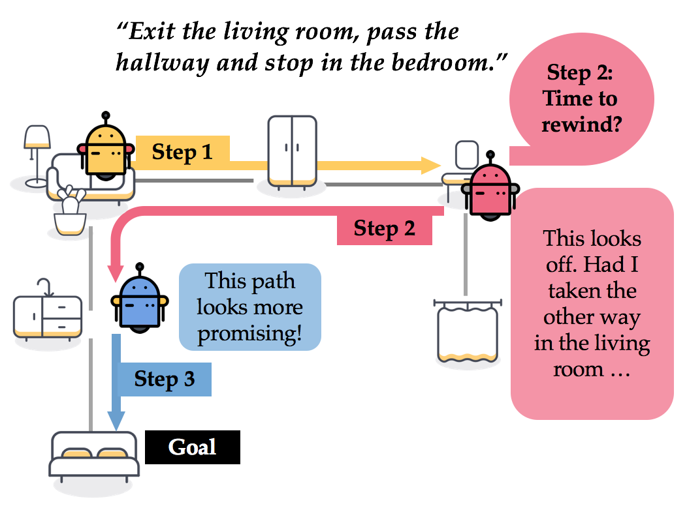
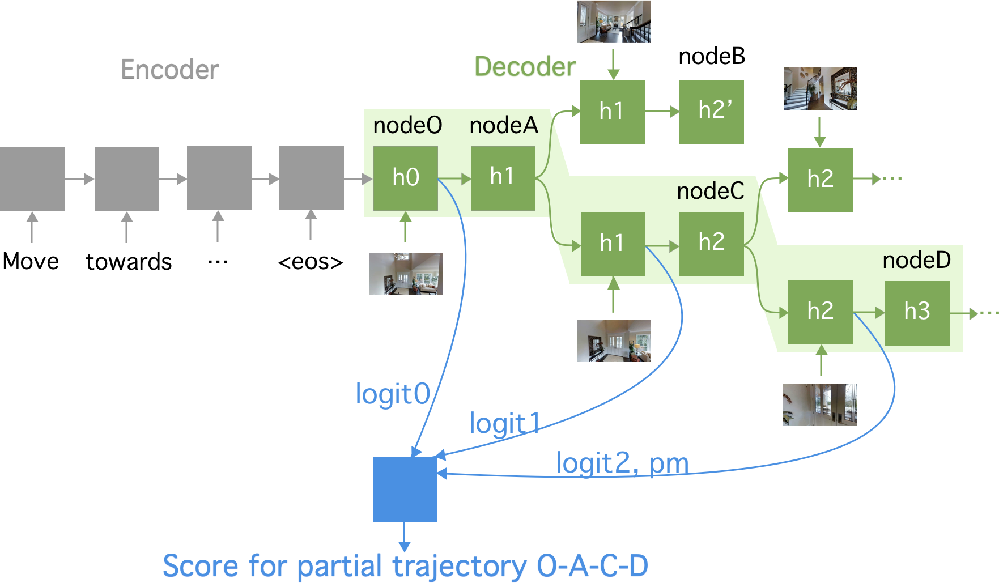

# Tactical Rewind: Self-Correction via Backtracking in Vision-and-Language Navigation

This is the PyTorch implementation of our paper:

[**Tactical Rewind: Self-Correction via Backtracking in Vision-and-Language Navigation**](http://openaccess.thecvf.com/content_CVPR_2019/html/Ke_Tactical_Rewind_Self-Correction_via_Backtracking_in_Vision-And-Language_Navigation_CVPR_2019_paper.html)

_Liyiming Ke_, Xiujun Li, Yonatan Bisk, Ari Holtzman, Zhe Gan, Jingjing Liu, Jianfeng Gao, Yejin Choi, Siddhartha Srinivasa.
Proceedings of the IEEE Conference on Computer Vision and Pattern Recognition (CVPR), 2019. **(Oral)**


_Motivation_


<!---->

## Bibtex

```
@inproceedings{ke2017tactile,
  title={Tactical Rewind: Self-Correction via Backtracking in Vision-and-Language Navigation},
  author={Liyiming Ke, Xiujun Li, Yonatan Bisk, Ari Holtzman, Zhe Gan, Jingjing Liu, Jianfeng Gao, Yejin Choi, Siddhartha Srinivasa.},
  booktitle={Proceedings of the IEEE Conference on Computer Vision and Pattern Recognition (CVPR)},
  year={2019}
}
```

## Installation and Usage

0. Our code was developed on Anaconda-installed python3.6, Pytorch 0.4.1 with one GPU TITAN Xp.

#### Set up the environment

1. Install the [Matterport3DSimulator](https://github.com/peteanderson80/Matterport3DSimulator). Then, download the pre-computed image features:

```
cd matterport3D
mkdir -p img_features/
cd img_features/
wget https://storage.googleapis.com/bringmeaspoon/img_features/ResNet-152-imagenet.zip -O ResNet-152-imagenet.zip
unzip ResNet-152-imagenet.zip
cd .. 
# After this step, `img_features/` should contain `ResNet-152-imagenet.tsv`.
```

2. Download this repo, extract the contents into `matterport3D/tasks/R2R`.

3. Download the [Room-to-Room dataset](https://github.com/peteanderson80/Matterport3DSimulator/tree/master/tasks/R2R), the synthetic data and the speaker model proposed by [Speaker-Follower Models for Vision-and-Language Navigation (NIPS2018)](https://github.com/ronghanghu/speaker_follower).

```
./tasks/R2R/data/download.sh
./tasks/R2R/data/download_precomputed_augmentation.sh
./tasks/R2R/experiments/release/download_speaker_release.sh
```

4. Install python requirements:

`pip install -r tasks/R2R/requirements.txt`

#### Training and launching agents

5. Train a seq2seq follower agent.

    First, to train the SMNA agent described in [Self-Monitoring Navigation Agent](https://openreview.net/forum?id=r1GAsjC5Fm), store it in `./tasks/R2R/experiments/smna/`:

    ```
    python tasks/R2R/train.py --use_pretraining
                              --pretrain_splits train literal_speaker_data_augmentation_paths 
                              --feedback_method sample2step
                              --experiment_name smna
    ```

    Then, with only the trained agent, launch the FAST framework and evaluate on validation seen and unseen.

    ```
    python tasks/R2R/run_search.py --job search
                                   --load_follower tasks/R2R/experiments/smna/snapshots/[name of the latest model]
                                   --max_episode_len 40
                                   --K 20
                                   --logit 
                                   --experiment_name FAST_short
                                   --early_stop
    ```

    Note that the name of the trained model contains the performance, so you have to **find the name for your agent**. One example would be `smna/snapshots/follower_with_pretraining_cg_pm_sample_imagenet_mean_pooled_1heads_val_seen_iter_10_val_seen-success_rate=0.12`.


6. Train a goal reranker.

    First, cache the search queue. The following command will save the cached json file to the root of `matterport3D` folder:

    ```
    python tasks/R2R/run_search --job cache
                                --load_follower tasks/R2R/experiments/smna/snapshots/[name of the latest model]
                                --max_episode_len 40
                                --K 20
                                --logit
                                --experiment_name cacheFAST
    ```

    Second, move `Training Reranker.ipynb` to the root of `matterport3D` folder. Sequentially run through it to produce a goal reranker under `tasks/R2R/experiments/candidates_ranker_{}` where `{}` is the performance.


    Finally, launch the framework with goal reranker.

    ```
    python tasks/R2R/run_search.py --job search
                                   --load_follower tasks/R2R/experiments/smna/snapshots/[name of the latest model]
                                   --max_episode_len 40
                                   --K 20
                                   --logit 
                                   --beam
                                   --experiment_name FAST-long
                                   --load_reranker tasks/R2R/experiments/[name of the reranker model]
    ```

## Reproducing results & Release model

If you want to skip all the steps above, here is my trained SMNA model (`smna_model`) and intermediate files (`cache_XXX.json`) that I used to produce the result in the paper: [Google Drive](https://drive.google.com/drive/folders/1WDi2-SwjadehFo6DMwJNJwBkJh-elzqg?usp=sharing),


## Directory Structure

The main entrance to the framework is `run_search.py`. Follower agents live in `follower.py` and the main framework lives in `def _rollout_with_search()` within the `Seq2SeqAgent` class. Speaker agent in `speaker.py`. Various PyTorch modules are in `attn.py`, `model.py`. 

- `attn.py`
- `env.py`
- `eval.py`
- `follower.py`
- `model.py`
- `paths.py`
- `refine_search.py`
- `run_search.py`
- `running_mean_std.py`
- `speaker.py`
- `train.py`
- `utils.py`
- `vocab.py`


## Resources and Tips


1. If you have problem installing Matterport3DSimulator, Chih-Yao Ma, the author of [Self-Monitoring Navigation Agent for Vision-and-Language Navigation (ICLR2019)](https://github.com/chihyaoma/selfmonitoring-agent), has a [great installation guide](https://github.com/chihyaoma/selfmonitoring-agent).

2. The code is taken out from an actively developed repo. Some codes might be redundant but are kept here to allow the program to run. 

3. `--image_feature_type none` flag allow you to verify that your script is running, without loading the actual ImageFeatures. 

4. If you need more help, file an issue and drop me an email (`kayke@cs_dot_washington_dot_edu`), I'd get back to you as soon as I can!  


## Acknowledgements

This repository is built upon [Speaker-Follower Models for Vision-and-Language Navigation (NIPS2018)](https://github.com/ronghanghu/speaker_follower). The repository reproduced [Self-Monitoring Navigation Agent for Vision-and-Language Navigation (ICLR2019)](https://github.com/chihyaoma/selfmonitoring-agent). 
